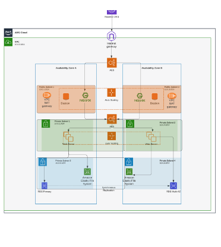
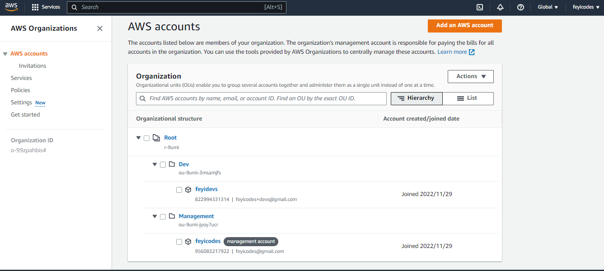

## Implementing AWS Cloud Solution For 2 Company Websites Using Reverse Proxy Technology

This projects expands the knowledge scope cloud exploration by looking at some concepts and tools available on AWS and other cloud providers. The project strenghtens my knowledge in the manual solutions to Clouod architecture, making the automation process more seamless. 
The project is based on a cloud architecture design that provides resilience to server failures, flexibility in managing traffic and cost effective.

I created a sub-account within my root account and an organizational unit named **Dev**. I added the sub account to the Dev organizational unit.

I created a hosted zone in AWS and mapped it to my registered domain **askogun.com**.

 I created a Virual Private Cloud with the appropriate subnet sufficient to cater for all instances that would be launched within. I created subnets as shown in the architecture and 2 different route tables associated with public subnet and private subnet. I created an internet gateway and edited aroute in the public route table, associating it with the internet gateway. 

 I created 3 elastic IPs, assigned one to the Nat Gateway and the other are to be assigned to Bastion host. I created 5 security groups catering for various infrastructure categories:
 * Nginx Servers
 * Bastion Servers
 * Application Load Balancer
 * Web servers
 * Data Layer.

 Based on the architecture, I would need to setup and configure the following resources in the VPC:
 EC2 INstances, Launch Templates, Target Groups, Autoscaling Groups, TLS Certificates and Application Load Balancers.

 I created an instance each of the Webserver, Nginx Server and Bastion Host server and carried out the necessary comfigurations to make it a suitable template for the architecture. 

