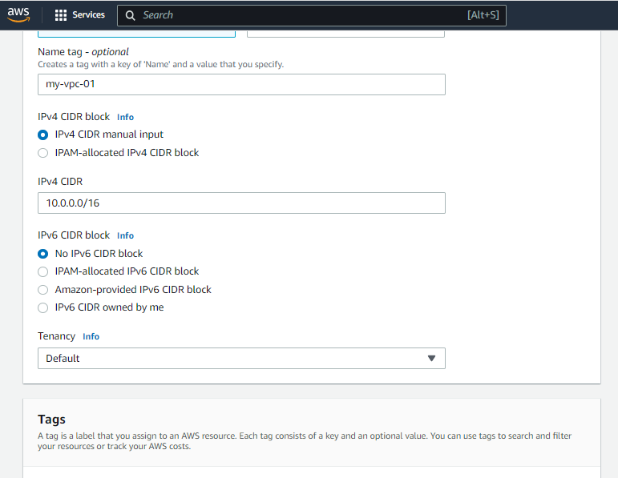
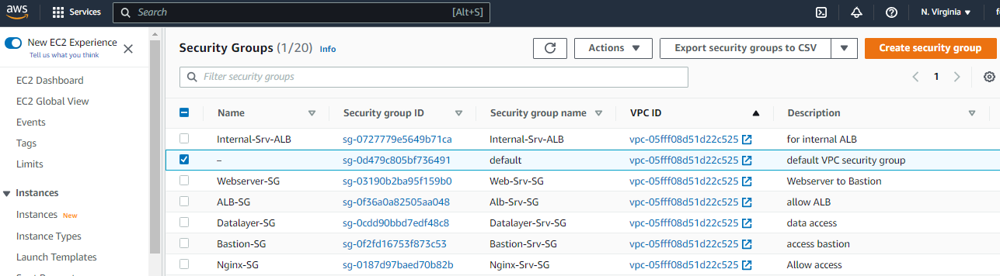

## Implementing AWS Cloud Solution For 2 Company Websites Using Reverse Proxy Technology

This projects expands the knowledge scope cloud exploration by looking at some concepts and tools available on AWS and other cloud providers. The project strenghtens my knowledge in the manual solutions to Clouod architecture, making the automation process more seamless. 
The project is based on a cloud architecture design that provides resilience to server failures, flexibility in managing traffic and cost effective.


I created a sub-account within my root account and an organizational unit named **Dev**. I added the sub account to the Dev organizational unit.


I created a hosted zone in AWS and mapped it to my registered domain **askogun.com**.


 I created a Virual Private Cloud with the appropriate subnet sufficient to cater for all instances that would be launched within. I created subnets as shown in the architecture and 2 different route tables associated with public subnet and private subnet. I created an internet gateway and edited aroute in the public route table, associating it with the internet gateway. 





I created 3 elastic IPs, assigned one to the Nat Gateway and the other are to be assigned to Bastion host.


I created 5 security groups catering for various infrastructure categories with the following characteristics:
 * Nginx Servers- Http/Https access from Application Load Balancer (External) security group and SSH access from Bastion security group.
 * Bastion Servers- SSH access from my IP
 * Application Load Balancer (Internal)- Http/Https access from NGINX security group
 * Application Load Balancer (External)- Http/Https access to all incoming traffic.
 * Web servers- Http/Https access from Application Load Balancer (Internal) security group and SSH access from Bastion security group.
 * Data Layer- Mysql/NFS access from NGINX security group and Mysql access from Bastion Server.




 Based on the architecture, I would need to setup and configure the following resources in the VPC:
 EC2 INstances, Launch Templates, Target Groups, Autoscaling Groups, TLS Certificates and Application Load Balancers.


I created target groups for all parts of the architecture behind a load balancer. The load balancer forwards traffic to target groups. The target groups created cater for nginx server, webservers and tooling servers. 


I created the external automatic load balancer (ALB) that is connected to the certificate manager and NGINX target group. 

;

I created the internal automatic load balancer (ALB) that is connected to the certificate manager as well as the wordpress target group as the primary connection and tooling target group as the secondary via adding a rule to the listener based on the HTTP host header.


I created launch templates for bastion, nginx and webserver templates with suitable user data. 


I created an elastic file system (EFS) and an accompanying mount target in the both  subnets for the webservers


I created 2 different Access Points for wordpress and tooling websites in order to avoid overwriting and distorting access. ;


I created a Key Management Service (KMS) for encrypting the database instance


I created an instance each of the Webserver, Nginx Server and Bastion Host server and carried out the necessary comfigurations to make it a suitable template for the architecture. 

The following code was used on all 3 instances for installing some of the necessary softwares namely: python, ntp, net-tools, vim, wget, telnet, epel-release, htop.
```
    yum install -y https://dl.fedoraproject.org/pub/epel/epel-release-latest-8.noarch.rpm

    yum install -y dnf-utils http://rpms.remirepo.net/enterprise/remi-release-8.rpm

    yum install wget vim python3 telnet htop git mysql net-tools chrony -y

    systemctl start chronyd

    systemctl enable chronyd
```
The following code was used to configure the seleniux policies for the webservers and nginx servers
```
    setsebool -P httpd_can_network_connect=1
    setsebool -P httpd_can_network_connect_db=1
    setsebool -P httpd_execmem=1
    setsebool -P httpd_use_nfs 1
```

I also configured the utilities for mounting targets on Elastic File System for webserver and nginx server.
```
    git clone https://;github.com/aws/efs-utils

    cd efs-utils

    yum install -y make

    yum install -y rpm-build

    make rpm 

    yum install -y  ./build/amazon-efs-utils*rpm
```

I configured the self signed certificate for the nginx instance:

```
    sudo mkdir /etc/ssl/private

    sudo chmod 700 /etc/ssl/private

    openssl req -x509 -nodes -days 365 -newkey rsa:2048 -keyout /etc/ssl/private/ACS.key -out /etc/ssl/certs/ACS.crt

    sudo openssl dhparam -out /etc/ssl/certs/dhparam.pem 2048
```
 
I configured the self signed certificate for apache for the webservers, given that they would be used to host them using the following codes:
```
    yum install -y mod_ssl

    openssl req -newkey rsa:2048 -nodes -keyout /etc/pki/tls/private/ACS.key -x509 -days 365 -out /etc/pki/tls/certs/ACS.crt

    vi /etc/httpd/conf.d/ssl.conf
```

After completing the configuration of the 3 instances, I created their images as template for usage hereafter.


